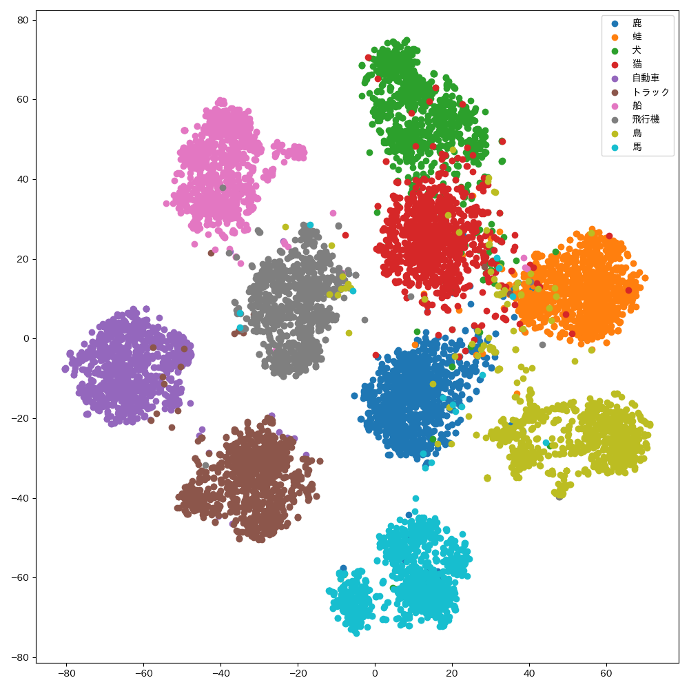

# clip-eval

clip-eval is a tool for evaluating CLIP models on various image classification and image-text retrieval tasks in Japanese.

## Installation
```bash
rye sync
```

## Usage

### Zero-shot image classification tasks.

Evaluate CLIP on imagenet-1k dataset.
```bash
python src/clip_eval/eval.py --model  openai/clip-vit-base-patch16 --dataset imagenet-1k
```
The output json file (`results/imagenet-1k/openai-clip-vit-base-patch16.json`) is like this:
```
{
    "top1": 4.1579999999999995,
    "top5": 8.816,
    "top10": 11.584,
    "top100": 30.296
}
```

When evaluating on `Recruit` dataset, you can specify the `--subcategory` option to evaluate on a specific subcategory.
```bash
python src/clip_eval/eval.py --model  openai/clip-vit-base-patch16 --dataset recruit --subcategory "jafacility20"
```

### Zero-shot image-to-text and text-to-image retrieval tasks.

Evaluate CLIP on crossmodal3600 dataset.
```bash
python src/clip_eval/eval.py --model  openai/clip-vit-base-patch16 --dataset crossmodal3600
```

### Embedding Analysis
You can calculate the similarity matrix of the embeddings (Only first (image,text) pair per class is used).
```bash
python src/clip_eval/embedding_analysis.py --model line-corporation/clip-japanese-base --dataset recruit --batch_size 16
```
The generated image is like this:
<figure>
  
  <figcaption>Similarity matrix of embeddings.</figcaption>
</figure>

This matrix is calculated by

```python
text_embeddings # (num_classes, embedding_dim)
image_embeddings # (num_classes, embedding_dim)
embeddings = torch.cat([text_embeddings, image_embeddings], dim=0) # (2*num_classes, embedding_dim)
normalized_embeddings = torch.nn.functional.normalize(embeddings, dim=1) # (2*num_classes, embedding_dim)
similarity_matrix = normalized_embeddings @ normalized_embeddings.T # (2*num_classes, 2*num_classes)
```
So, the Left-Top submatrix is the similarity matrix of text embeddings, and the Right-Bottom submatrix is the similarity matrix of image embeddings. The Right-Top and Left-Bottom submatrices are the similarity between text and image embeddings.


You can also visualize the embeddings using t-SNE (Only first 10 classes are used).
```bash
python src/clip_eval/tsne_plot.py --model line-corporation/clip-japanese-base --dataset_name cifar10 --batch_size 16
```
The generated image is like this:
<figure>
  
  <figcaption>t-SNE plot of image embeddings.</figcaption>
</figure>


## Supported Models
- [line-corporation/clip-japanese-base](https://huggingface.co/line-corporation/clip-japanese-base)
- [rinna/japanese-cloob-vit-b-16](https://huggingface.co/rinna/japanese-cloob-vit-b-16)
- [rinna/japanese-clip-vit-b-16](https://huggingface.co/rinna/japanese-clip-vit-b-16)
- [hf-hub:laion/CLIP-ViT-H-14-frozen-xlm-roberta-large-laion5B-s13B-b90k](https://huggingface.co/laion/CLIP-ViT-H-14-frozen-xlm-roberta-large-laion5B-s13B-b90k)
- [stabilityai/japanese-stable-clip-vit-l-16](https://huggingface.co/stabilityai/japanese-stable-clip-vit-l-16)
- [openai/clip-vit-base-patch16](https://huggingface.co/openai/clip-vit-base-patch16)
- [openai/clip-vit-large-patch14](https://huggingface.co/openai/clip-vit-large-patch14)
- [jinaai/jina-clip-v2](https://huggingface.co/jinaai/jina-clip-v2)
- [google/siglip-base-patch16-256-multilingual](https://huggingface.co/google/siglip-base-patch16-256-multilingual)

## Supported Datasets
### Image Classification
- [`imagenet-1k`](https://huggingface.co/datasets/ILSVRC/imagenet-1k): ImageNet-1k image classification dataset
- [`recruit`](https://huggingface.co/datasets/recruit-jp/japanese-image-classification-evaluation-dataset): Japanese-culture related image classification dataset
- [`cifar100`](https://huggingface.co/datasets/uoft-cs/cifar100): CIFAR-100 image classification dataset
- [`cifar10`](https://huggingface.co/datasets/uoft-cs/cifar10): CIFAR-10 image classification dataset
- [`food101`](https://huggingface.co/datasets/ethz/food101): Food-101 image classification dataset
- [`caltech101`](https://huggingface.co/datasets/flwrlabs/caltech101): Caltech-101 image classification dataset

### Image-Text Retrieval
- [`crossmodal3600`](https://google.github.io/crossmodal-3600): Cross-modal image-text retrieval dataset

## Acknowledgement
We would like to acknowledge the following codebases that served as the foundation for our work:
- [japanese-clip](https://github.com/rinnakk/japanese-clip)
- [CLIP_benchmark](https://github.com/LAION-AI/CLIP_benchmark)

We would also like to express our gratitude to the dataset and model developers.

## Bibtex
```
@inproceedings{sugiura-etal-2025-developing,
    title = "Developing {J}apanese {CLIP} Models Leveraging an Open-weight {LLM} for Large-scale Dataset Translation",
    author = "Sugiura, Issa  and
      Kurita, Shuhei  and
      Oda, Yusuke  and
      Kawahara, Daisuke  and
      Okazaki, Naoaki",
    editor = "Ebrahimi, Abteen  and
      Haider, Samar  and
      Liu, Emmy  and
      Haider, Sammar  and
      Leonor Pacheco, Maria  and
      Wein, Shira",
    booktitle = "Proceedings of the 2025 Conference of the Nations of the Americas Chapter of the Association for Computational Linguistics: Human Language Technologies (Volume 4: Student Research Workshop)",
    month = apr,
    year = "2025",
    address = "Albuquerque, USA",
    publisher = "Association for Computational Linguistics",
    url = "https://aclanthology.org/2025.naacl-srw.15/",
    pages = "162--170",
    ISBN = "979-8-89176-192-6",
    abstract = "CLIP is a foundational model that bridges images and text, widely adopted as a key component in numerous vision-language models.However, the lack of large-scale open Japanese image-text pairs poses a significant barrier to the development of Japanese vision-language models.In this study, we constructed a Japanese image-text pair dataset with 1.5 billion examples using machine translation with open-weight LLMs and pre-trained Japanese CLIP models on the dataset.The performance of the pre-trained models was evaluated across seven benchmark datasets, achieving competitive average scores compared to models of similar size without the need for extensive data curation. However, the results also revealed relatively low performance on tasks specific to Japanese culture, highlighting the limitations of translation-based approaches in capturing cultural nuances. Our dataset, models, and code are publicly available."
}
```
